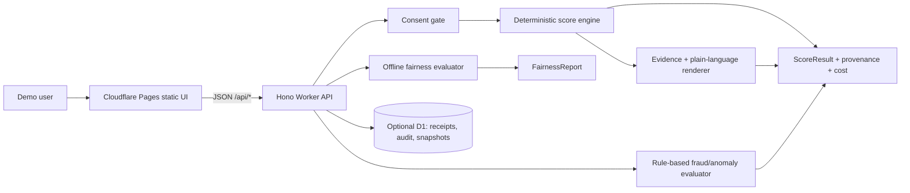

# Architecture and Compliance Decision Memo

**Project:** AI-Driven Dynamic Underwriting Using Alternative Data

**Date:** 2026-08-07 (Asia/Kolkata)

**Decision status:** Proposed MVP lock. Broad implementation starts only after the shared contract is accepted.

## Executive decision

Build a **simulation-only underwriting workbench** with a deterministic, interpretable point score. The score compares a traditional application/bureau baseline with consented alternative signals, recomputes after a consented behavior update, and emits structured evidence that a template renderer turns into plain language. Fraud/anomaly detection remains a separate review signal. Fairness is evaluated offline on synthetic, evaluation-only cohorts and is explicitly not a legal conclusion.

Use a small two-surface Cloudflare deployment:

- **Pages:** static frontend for the consent wizard, score comparison, evidence, behavior update, anomaly, fairness, provenance, and limitations views.
- **Worker/Hono:** JSON API for consent, scoring, behavior update, fairness evaluation, audit, and health routes.
- **D1:** use only for consent receipts, audit events, and demo snapshots when a Cloudflare account is already available; keep the model pure and provide a local fixture/in-memory adapter so D1 is not a local development blocker.

## Why this boundary is the right one

The CFPB interagency statement says alternative data can expand access and improve speed/accuracy, while also requiring analysis of applicable consumer-protection obligations before use. The MVP therefore treats every alternative signal as opt-in, purpose-bound, provenance-tagged, and removable from the score when consent is absent or revoked.

The CFPB states that complex algorithms do not remove the requirement for specific and accurate adverse-action reasons. The product therefore never asks an LLM to discover reasons: the score engine emits feature-level contributions and the UI only verbalizes those contributions. The demo labels the result as a simulation and does not issue an adverse-action notice or make a real credit decision.

NIST AI RMF frames trustworthy AI around governing, mapping, measuring, and managing risk. The MVP makes those functions visible through an allowlisted feature registry, provenance/audit events, deterministic tests, synthetic fairness measurements, and an explicit limitations panel.

The legal sources below are U.S.-focused and time-sensitive. No jurisdiction is assumed for production use, and this memo is not legal advice. Current Regulation B materials changed in 2026; the fairness dashboard is retained as an engineering safety diagnostic, not as a claim about a universal legal disparate-impact standard.

## Locked safety invariants

1. **No real decision:** the output is `simulation_band` plus `review_signals`, never approve/deny/price/limit.
2. **Consent before use:** alternative data and behavior events contribute only when a valid receipt covers the purpose and category. Revocation removes the contribution on the next score.
3. **No protected/proxy inputs:** the model feature registry rejects names, age, gender, race, religion, disability, nationality, precise location, device fingerprint, social graph, and other proxy-like fields.
4. **Source of truth:** score, band, fraud flags, evidence, and cost are calculated by deterministic code. An explanation renderer may not add a reason that is absent from `evidence[]`.
5. **Separate fraud path:** anomalies produce `clear`, `review`, or `high_review` plus flags; they do not silently change the risk score or auto-deny.
6. **Synthetic fairness only:** evaluation cohorts are generated labels, not protected traits, not inferred, and not exposed as applicant inputs.
7. **Data minimization:** store pseudonymous IDs and aggregate/derived values only; no credentials or raw external account data.
8. **Auditability:** every score records model version, feature registry version, input provenance, consent IDs used, timestamp, evidence, and cost estimate.

## MVP feature allowlist

### Baseline/application features

- `bureauScore` (synthetic bureau-like score)
- `monthlyIncome`
- `monthlyDebt`
- `employmentMonths`
- `applicationCompleteness`

### Consent-gated alternative features

- `cashflowStability` (derived range 0–1)
- `incomeConsistency` (derived range 0–1)
- `savingsBufferMonths` (bounded integer)
- `onTimePaymentRate` (derived range 0–1)

### Separate anomaly features

- `incomeExpenseMismatch`
- `duplicateApplicationBurst`
- `impossibleEventSequence`

No feature above is a protected attribute or a declared proxy. The feature registry is the enforcement point; unknown or disallowed fields fail closed.

## Score contract

The proposed score is a fixed 0–100 point score, not a probability of repayment:

```text
baseline = weighted contributions from bureau/application fields
alternative = weighted contributions from consented alternative fields
dynamicScore = clamp(baseline + consentedAlternative - anomalyRiskAdjustment, 0, 100)
```

The initial version should use published constants in the model registry, not learned weights:

- baseline: 65% of total points
- alternative: 35% of total points when valid consent exists
- anomaly adjustment: capped, separately disclosed, and applied only for explicitly defined consistency anomalies

Risk bands are fixed and visible in the UI, for example `watch`, `guarded`, `stable`, and `strong`. The exact thresholds must be in the shared schema and tests so the demo cannot drift between frontend and API.

The result must include each contribution with: feature key, display label, normalized value, signed points, direction, source, consent ID (or `null` for baseline), and evidence text generated from the same structured record. A missing alternative consent must visibly produce a baseline-only result.

## Consent and provenance flow

The UI must show purposes separately:

- `application_baseline`
- `alternative_cashflow`
- `behavior_updates`
- `fraud_screening`

Before scoring, the user sees the data categories, source (`synthetic_fixture` or `consented_manual_entry`), intended purpose, retention for the demo, revocation behavior, and a checkbox/affirmative action per purpose. The API creates a receipt hash and audit event. A score response lists exactly which receipts were used.

Revocation is a first-class action. After revocation, the next score must exclude the affected signals, change the provenance list, and explain that the alternative contribution was not used; no silent fallback is allowed.

## Fraud/anomaly behavior

Use explainable rules over synthetic events. Examples are an income/expense inconsistency beyond a documented bound, duplicated applications in a short synthetic window, and impossible event ordering. Return flags, severity, rule version, evidence, and recommended action `manual_review`; never claim the applicant committed fraud.

## Fairness/disparate-impact evaluation

The evaluator runs over a fixed synthetic test fixture with `evaluationCohort` labels created for test stratification only. The model never reads the label. Report, per cohort:

- sample count;
- positive/high-band or low-risk rate;
- outcome rate where a synthetic outcome label exists;
- selection-rate ratio / adverse-impact ratio relative to the reference cohort;
- sample-size warning and limitations.

The UI must call this a **synthetic parity diagnostic**. It must state that small synthetic cohorts do not establish production fairness, legal compliance, causality, or absence of proxy effects.

## Data/audit schema decisions

The shared schema wave should lock these objects before worker implementation:

```text
ConsentReceipt
ApplicantProfile
BehaviorUpdate
ScoreRequest
ScoreResult
EvidenceItem
ProvenanceRecord
FraudReview
FairnessReport
AuditEvent
CostBreakdown
```

Every public API response includes `schemaVersion`, and every score includes `modelVersion`, `featureRegistryVersion`, `scoreId`, and `generatedAt`. The model package must be callable without a Worker runtime so unit and fairness tests can run locally.

## Deployment and cost decision

Pages hosts static assets and the Worker/Hono API handles JSON routes. This keeps the UI deploy independently from the model/API while keeping the stack small. Hono documents typed Cloudflare bindings and module Worker exports; Cloudflare’s Pages guide documents Hono deployment and Pages build outputs. D1 migrations are versioned SQL files and should be used only for the small consent/audit tables.

For the hackathon demo, cost per decision is an explicit measured/estimated breakdown, not a hidden claim:

```text
costPerDecision = model_compute + data_access + storage_write + explanation
```

The MVP has no paid external data call and no LLM call, so `data_access = 0` and `explanation = 0` by design. The response reports local compute timing and the deployment cost basis separately; it must not invent a provider invoice. If no Cloudflare account/plan is available, the final report says deployment cost is unverified and shows local demo cost only.

## Deliberately excluded scope

- real bureau, bank, payroll, telco, social, device, or open-web integrations;
- scraping, credential collection, account linking, or identity verification;
- real lending decisions, pricing, adverse-action notices, or production underwriting;
- authentication/authorization, billing, queues, notifications, or multi-tenant infrastructure;
- training a black-box model or using an LLM in the decision path;
- protected-trait collection, proxy inference, or production fairness claims;
- automatic fraud denial;
- production data retention/deletion guarantees beyond the demo controls;
- legal advice or jurisdiction-specific compliance certification.

## 8-minute demo outline

| Time | Demonstration | Proof point |
|---|---|---|
| 0:00–0:45 | Safety banner and consent purposes | Explicit opt-in, no real decision |
| 0:45–1:45 | Load synthetic applicant / add consented manual sample | Provenance and receipt |
| 1:45–3:15 | Compare baseline vs. alternative-enabled score | Dynamic band and contribution ledger |
| 3:15–4:20 | Open explanation/evidence panel | Plain language is generated from evidence only |
| 4:20–5:20 | Apply behavior update | Before/after score delta with consent check |
| 5:20–6:10 | Trigger anomaly fixture | Separate manual-review signal |
| 6:10–7:15 | Run fairness diagnostic | Cohort metrics and caveats |
| 7:15–8:00 | Show provenance, audit, cost, architecture, limits | End-to-end accountability |

## Architecture diagram



## Official sources consulted (accessed 2026-08-07)

1. [CFPB interagency statement on alternative data in credit underwriting](https://www.consumerfinance.gov/archive/newsroom/federal-regulators-issue-joint-statement-use-alternative-data-credit-underwriting/) — potential benefits and requirement to analyze consumer-protection obligations.
2. [CFPB Circular 2022-03 on adverse-action notices and complex algorithms](https://www.consumerfinance.gov/compliance/circulars/circular-2022-03-adverse-action-notification-requirements-in-connection-with-credit-decisions-based-on-complex-algorithms/) — reasons must be specific, accurate, and tied to factors actually used.
3. [CFPB Regulation B / 12 CFR Part 1002](https://www.consumerfinance.gov/rules-policy/regulations/1002/) — current scope and time-sensitive 2026 amendments; consult the official legal text for deployment decisions.
4. [FTC Fair Credit Reporting Act overview](https://www.ftc.gov/legal-library/browse/statutes/fair-credit-reporting-act) — consumer-report purpose and adverse-action obligations are relevant if a real report were ever integrated; the MVP uses synthetic bureau-like fields only.
5. [NIST AI Risk Management Framework](https://www.nist.gov/itl/ai-risk-management-framework) — voluntary Govern/Map/Measure/Manage framing and trustworthy-AI risk controls.
6. [NIST Privacy Framework](https://www.nist.gov/privacy-framework) — voluntary privacy-risk management framing.
7. [Cloudflare Pages Hono deployment guide](https://developers.cloudflare.com/pages/framework-guides/deploy-a-hono-site/) — Pages build/deployment shape and Hono compatibility.
8. [Hono Cloudflare Workers guide](https://hono.dev/docs/getting-started/cloudflare-workers) — typed bindings, module Worker export, static assets, and testing guidance.
9. [Cloudflare D1 migrations](https://developers.cloudflare.com/d1/reference/migrations/) — versioned migration files and local/remote migration workflow.

## Open gates

- GitHub credential: `gh auth status` reports an invalid token for `Rakesh-207`; private repository creation and push are blocked until re-authentication.
- Orca runtime: `/usr/local/bin/orca status --json` reports `not_running`; `orca open --json` did not start it and emitted a macOS code-signing error. Parallel supervised dispatch cannot begin until Orca is available.
- Cloudflare credentials: not checked yet; deployment remains conditional on an existing authenticated Wrangler account after the MVP is implemented and verified.
