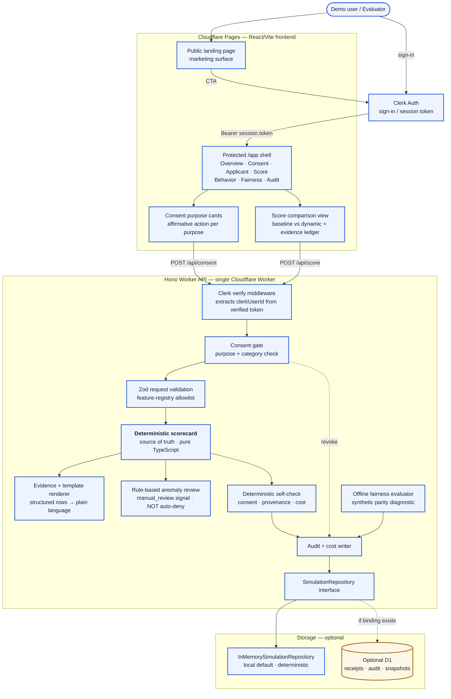
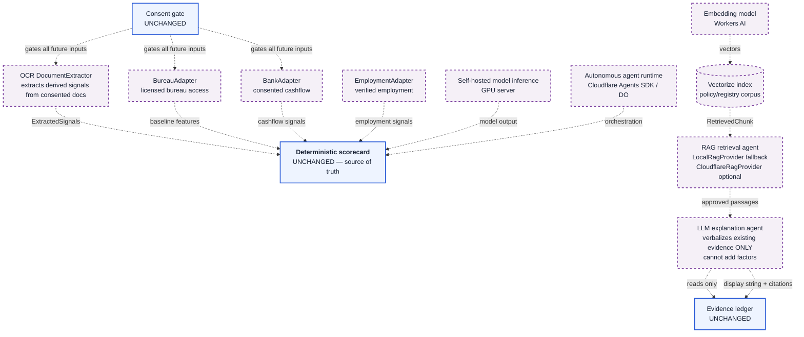
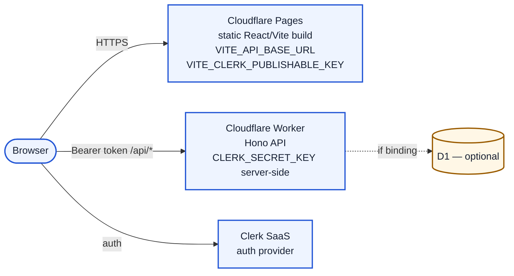

# Architecture Diagram

**Status:** First review (deterministic slice)
**Date:** 2026-08-07

This document describes two architectures: the **current** first-review slice (implemented and demoable) and the **future** extension architecture (designed interfaces, not implemented). The deterministic core is identical in both — future components attach to the same score engine without rewriting it.

## 1. Current architecture (first review — implemented)

The first review is a two-surface Cloudflare deployment: a React/Vite frontend on Cloudflare Pages and a Hono API on a single Cloudflare Worker. The score engine is pure TypeScript and has no runtime dependency on an LLM, OCR, RAG, or any live provider. D1 is optional persistence; an in-memory repository is the default local mode.

### Data flow (current slice)

1. **Auth:** The user signs in via Clerk. The frontend obtains a session token via `getToken()` and attaches it as `Authorization: Bearer <token>` to every `/api/*` request. The Worker middleware verifies the token and extracts `clerkUserId` (`sub`). Identity is separate from consent.
2. **Consent before data:** No application or alternative data is returned, scored, or persisted before a server-created `ConsentReceipt` exists for the required purpose and category. `GET /api/demo/applicants` is protected and receipt-gated.
3. **Score request:** The Worker loads authoritative receipts server-side (never trusts a client-claimed receipt), validates the applicant against the allowlisted feature registry, and calls the deterministic scorecard.
4. **Deterministic compute:** The score engine computes baseline (65% weight) + consented alternative (35% weight) − capped anomaly adjustment, clamped to 0–100. It emits a structured `evidence[]` array with per-feature signed points.
5. **Evidence rendering:** A template renderer turns each evidence row into plain language. No LLM is in the path. The renderer may not add a reason absent from `evidence[]`.
6. **Anomaly separation:** Rule-based anomaly checks run on a separate path and return `clear` / `review` / `high_review` + flags. They never silently change the risk score or auto-deny.
7. **Behavior update:** A consent-checked event recomputes the score and returns before/after + delta + changed evidence. A revoked receipt blocks the update with `CONSENT_REQUIRED`.
8. **Audit + cost:** Every consent mutation, score, behavior update, fairness run, and validation failure writes an audit event with model version, feature registry version, consent IDs, provenance refs, and a measured cost estimate.
9. **Storage:** The route layer depends on a `SimulationRepository` interface. Local default is `InMemorySimulationRepository`; D1 is a deferred adapter that stores only receipts, audit events, snapshots, and redacted trace events — never credentials or raw personal data.

### Component responsibility table (current)

| Component | Responsibility | Implemented? |
|-----------|----------------|--------------|
| Clerk auth (frontend `@clerk/react`) | Sign-in/up, session token acquisition, protected-route guard | ✅ Yes |
| Clerk verify middleware (Worker) | Token verification, principal extraction, ownership checks | ✅ Yes |
| Consent gate | Purpose + category receipt enforcement; revocation handling | ✅ Yes |
| Feature-registry allowlist | Reject protected/proxy/unknown fields at schema boundary | ✅ Yes |
| Deterministic scorecard | Baseline + alternative − anomaly → 0–100 index + evidence | ✅ Yes |
| Evidence template renderer | Structured evidence → plain language (no LLM) | ✅ Yes |
| Rule-based anomaly review | Flags + manual_review signal (never auto-deny) | ✅ Yes |
| Offline fairness evaluator | Synthetic parity diagnostic on evaluation-only cohorts | ✅ Yes |
| Deterministic self-check | Consent, provenance, evidence, cost consistency | ✅ Yes |
| Audit + cost writer | Append-only audit events + measured cost | ✅ Yes |
| InMemorySimulationRepository | Local deterministic storage | ✅ Yes |
| D1SimulationRepository | Optional D1 persistence (receipts/audit/snapshots) | ⚠️ Conditional (binding required) |
| Optional explanation stream | Display-only explanation panel stream (display-only) | ⚠️ Optional / deferred |

---

## 2. Future architecture (NOT implemented — design only)

The interfaces below are **defined** in the vertical-slice design so that future adapters cannot alter the contract, but **no implementation exists** in the first review. These are labelled `Future scope` everywhere they appear. The deterministic core (scorecard, evidence, consent gate, audit) is unchanged — future components attach as typed cooperating units around it.

### Future component status

| Future component | Interface defined? | Implemented? | Boundary rule |
|------------------|--------------------|--------------|---------------|
| OCR (`DocumentExtractor`) | ✅ Yes | ❌ No | Must produce `ExtractedSignals` with provenance; consent-gated. |
| LLM explanation agent | ✅ Yes (evidence-constrained) | ❌ No | May only verbalize `ScoreResult.evidence`; cannot write back to score. Deterministic template fallback remains the default. |
| RAG retrieval (`Retriever`) | ✅ Yes | ❌ No | `LocalRagProvider` is guaranteed fallback. Corpus contains only versioned policy/registry/scorecard docs — no applicant data. |
| Embedding + Vectorize (`CloudflareRagProvider`) | ✅ Yes | ❌ No | Requires Workers AI + Vectorize bindings. Every retrieved passage carries `documentId`, `sourceUrl`, `version`, `citation`. |
| Self-hosted model inference | ❌ No (assumption) | ❌ No | Would replace/augment deterministic scorecard only by explicit contract change. Not designed in this slice. |
| Bureau / Bank / Payroll adapters | ✅ Yes (adapter contracts) | ❌ No | Require licensed provider access + credentials. None are simulated as live. |
| Autonomous agents (Agents SDK / DO) | ✅ Yes (typed interfaces) | ❌ No | Designed as typed cooperating units, not prompt-defined behavior. Not in the first review. |

### Key invariant preserved across current and future

> The deterministic scorecard remains the source of truth. No agent, LLM, or future adapter may alter `riskScore`, `riskBand`, consent decisions, or score contributions. The score is calculated by deterministic code before any optional explanation rendering begins. Streaming, if ever enabled, is display-only and limited to the explanation panel.

---

## 3. Deployment topology

- **Pages** hosts the static frontend build. It receives `VITE_API_BASE_URL` and `VITE_CLERK_PUBLISHABLE_KEY` only. No secret is bundled into the client.
- **Worker** hosts the Hono API. `CLERK_SECRET_KEY` is a server-side secret in Wrangler/Cloudflare secret storage — never exposed through Vite, logs, or error payloads.
- **D1** is conditional on a verified binding/account. If absent, the Worker uses the in-memory repository and reports `repository: "memory"`. Local development never requires Cloudflare credentials.
- **CORS** permits the configured local origin and deployed Pages origin only; failures use the shared `ErrorEnvelope`.

## 4. Route inventory (current)

| Route | Auth | Consent | Purpose |
|-------|------|---------|---------|
| `GET /api/health` | Public liveness exception | — | Service/repository/schema status only |
| `GET /api/demo/applicants` | Protected | Receipt-gated | No application data before consent |
| `POST /api/consent` | Protected | — | Server derives `clerkUserId` |
| `POST /api/consent/:consentId/revoke` | Protected + ownership | — | Mark revoked, audit event |
| `POST /api/score` | Protected + ownership | Receipt required | Deterministic score + evidence |
| `POST /api/behavior` | Protected + ownership | `behavior_updates` purpose | Before/after delta |
| `POST /api/fairness` | Protected | Bound to simulation | Synthetic parity diagnostic |
| `GET /api/audit/:simulationId` | Protected + ownership | — | Audit trail, provenance, cost |
